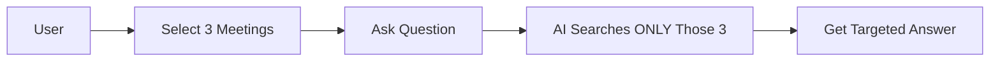
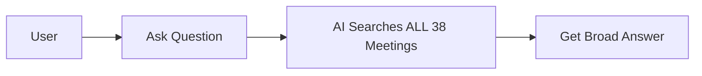
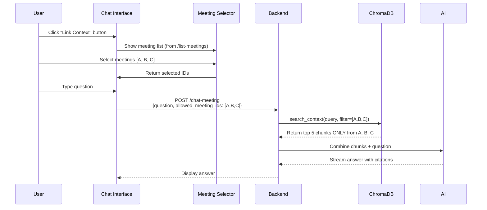

# Ask AI with Context Feature

## Overview

**Ask AI with Context** allows users to ask questions about meetings with two powerful modes:
1. **Linked Context** (Scoped Search) - Search specific selected meetings
2. **Global Context** - Search across all past meetings

## Modes Explained

### 🔗 Linked Context (Scoped Search)

**When to Use**:
- You know exactly which meetings are relevant
- Focused, precise answers needed
- Working on a specific project with related meetings

**How It Works**:


**Example**:
```
Linked: [Q4 Planning, Budget Review, Marketing Strategy]
Question: "What's the approved marketing budget?"
Answer: "Based on Budget Review (Jan 5), the approved budget is $50k..."
```

### 🌐 Global Context (All Meetings)

**When to Use**:
- Exploratory questions
- Don't know which meeting discussed the topic
- Searching for patterns across all meetings

**How It Works**:


**Example**:
```
Linked: [None]
Question: "What have we discussed about hiring?"
Answer: "Hiring was mentioned in 5 meetings: Product Sync (Dec 10), Budget Review (Jan 5)..."
```

## Technical Architecture

### User Workflow



### Backend Implementation

**1. Scoped Search (`vector_store.py`)**
```python
async def search_context(
    query: str, 
    allowed_meeting_ids: List[str] = None,
    n_results: int = 5
) -> List[Dict]:
    collection = _get_collection()
    
    # Build filter
    if allowed_meeting_ids:
        where_filter = {"meeting_id": {"$in": allowed_meeting_ids}}
    else:
        where_filter = None  # Search everything
    
    # Semantic search
    results = collection.query(
        query_texts=[query],
        n_results=n_results,
        where=where_filter  # 🔑 Key difference!
    )
    
    return results
```

**2. Chat Endpoint (`main.py`)**
```python
@app.post("/chat-meeting")
async def chat_meeting(request: ChatRequest):
    # 1. Get current meeting context
    current_context = request.context_text or ""
    
    # 2. Search past meetings (scoped or global)
    past_context = await search_context(
        query=request.question,
        allowed_meeting_ids=request.allowed_meeting_ids  # None = search all
    )
    
    # 3. Combine and generate answer
    full_context = f"""
    Current Meeting: {current_context}
    
    Past Meeting Context:
    {format_chunks(past_context)}
    """
    
    # 4. Stream response
    return StreamingResponse(ai_response, media_type="text/plain")
```

### Frontend Implementation

**3. Meeting Selector (`MeetingSelector.tsx`)**
```typescript
const MeetingSelector = ({ onSelect }) => {
    const [meetings, setMeetings] = useState([]);
    const [selected, setSelected] = useState<string[]>([]);
    
    useEffect(() => {
        // Fetch all available meetings
        fetch('/list-meetings')
            .then(res => res.json())
            .then(data => setMeetings(data));
    }, []);
    
    const handleToggle = (id: string) => {
        setSelected(prev => 
            prev.includes(id) 
                ? prev.filter(x => x !== id)  // Remove
                : [...prev, id]                // Add
        );
    };
    
    return (
        <div>
            {meetings.map(m => (
                <Checkbox 
                    key={m.id}
                    checked={selected.includes(m.id)}
                    onChange={() => handleToggle(m.id)}
                    label={m.title}
                />
            ))}
            <Button onClick={() => onSelect(selected)}>
                Link {selected.length} Meetings
            </Button>
        </div>
    );
};
```

**4. Chat Interface (`ChatInterface.tsx`)**
```typescript
const ChatInterface = () => {
    const [linkedMeetingIds, setLinkedMeetingIds] = useState<string[]>([]);
    const [showSelector, setShowSelector] = useState(false);
    
    const handleSendMessage = async (question: string) => {
        const response = await fetch('/chat-meeting', {
            method: 'POST',
            body: JSON.stringify({
                question,
                allowed_meeting_ids: linkedMeetingIds.length > 0 
                    ? linkedMeetingIds 
                    : undefined,  // undefined = global search
                // ... other fields
            })
        });
        
        // Stream and display response
    };
    
    return (
        <>
            <Button onClick={() => setShowSelector(true)}>
                Link Context ({linkedMeetingIds.length})
            </Button>
            
            {linkedMeetingIds.length > 0 && (
                <Badge>Searching {linkedMeetingIds.length} meetings</Badge>
            )}
            
            <ChatMessages />
            <ChatInput onSend={handleSendMessage} />
            
            {showSelector && (
                <Modal>
                    <MeetingSelector 
                        onSelect={ids => {
                            setLinkedMeetingIds(ids);
                            setShowSelector(false);
                        }}
                    />
                </Modal>
            )}
        </>
    );
};
```

## Search Behavior Comparison

| Aspect | Linked Context | Global Context |
|--------|----------------|----------------|
| **Meetings Searched** | Only selected (e.g., 3) | All 38 meetings |
| **Search Speed** | Faster | Slightly slower |
| **Result Precision** | High (focused) | Variable (broad) |
| **Use Case** | Known relevant meetings | Exploratory search |
| **Filter** | `meeting_id IN [A,B,C]` | No filter |
| **Top Results** | 5 chunks from 3 meetings | 5 chunks from ANY meeting |

## Examples

### Example 1: Budget Question

**Linked Context**:
```
Selected: [Q4 Planning, Budget Review]
Question: "What's the marketing budget?"
Result: "In Budget Review (Jan 5), we allocated $50k for marketing..."
✅ Precise, relevant
```

**Global Context**:
```
Selected: [None]
Question: "What's the marketing budget?"
Result: "Marketing budget was discussed in 3 meetings: Q4 Planning ($50k proposed), Budget Review ($50k approved), Feb Sync (spend review)..."
✅ Comprehensive, but less focused
```

### Example 2: Hiring Discussion

**Linked Context**:
```
Selected: [Product Sync, Engineering Standup]
Question: "Who are we hiring?"
Result: "In Product Sync, we discussed hiring a Senior Engineer and PM..."
✅ Team-specific
```

**Global Context**:
```
Selected: [None]
Question: "Who are we hiring?"
Result: "Hiring discussed across 7 meetings: Engineering (2 devs), Marketing (1 manager), Sales (3 reps)..."
✅ Company-wide view
```

## Best Practices

### When to Use Linked Context
1. **Project-specific questions**: Link all meetings in a project
2. **Time-bound queries**: Link meetings from specific quarter
3. **Topic clustering**: Link related strategic discussions

### When to Use Global Context
1. **Discovery**: "Has anyone mentioned X?"
2. **Patterns**: "What are recurring themes?"
3. **Unknown location**: "Where did we discuss Y?"

## Performance Considerations

### Linked Context (3 meetings)
- Vector search: ~50-100ms
- Chunks processed: ~30 total
- Top results: 5 (maybe 1-2 per meeting)
- **Recommended for**: Daily use

### Global Context (38 meetings)
- Vector search: ~200-500ms
- Chunks processed: ~90 total
- Top results: 5 (distributed across any)
- **Recommended for**: Occasional deep dives

## Token Usage

**Typical Request**:
```
Current Meeting Transcript:  500 tokens
Past Meeting Chunks (5):     625 tokens
Question:                     50 tokens
Chat History (10 messages): 1000 tokens
-------------------------------------------
Total Input:                2175 tokens
AI Response:                 ~500 tokens
-------------------------------------------
Total:                      2675 tokens (well within 8k limit ✅)
```

## API Reference

### Endpoint
```
POST /chat-meeting
```

### Request (Linked Context)
```json
{
    "meeting_id": "current-recording",
    "question": "What's the budget?",
    "model": "groq",
    "model_name": "llama-3.3-70b-versatile",
    "context_text": "We're discussing Q4 plans...",
    "allowed_meeting_ids": ["meeting-A", "meeting-B", "meeting-C"],
    "history": [
        {"role": "user", "content": "Hi"},
        {"role": "assistant", "content": "Hello!"}
    ]
}
```

### Request (Global Context)
```json
{
    "meeting_id": "current-recording",
    "question": "What's the budget?",
    "model": "groq",
    "model_name": "llama-3.3-70b-versatile",
    "context_text": "We're discussing Q4 plans...",
    "allowed_meeting_ids": null,  // or omit entirely
    "history": []
}
```

### Response
```
Content-Type: text/plain
Transfer-Encoding: chunked

Based on Budget Review (Jan 5), the approved budget...
```

## Future Enhancements

- [ ] Auto-suggest relevant meetings based on question
- [ ] Visual indicator showing which meetings were referenced
- [ ] Save and load meeting selection presets
- [ ] Time-based filters (last 7 days, this quarter, etc.)
- [ ] Tag-based meeting organization
