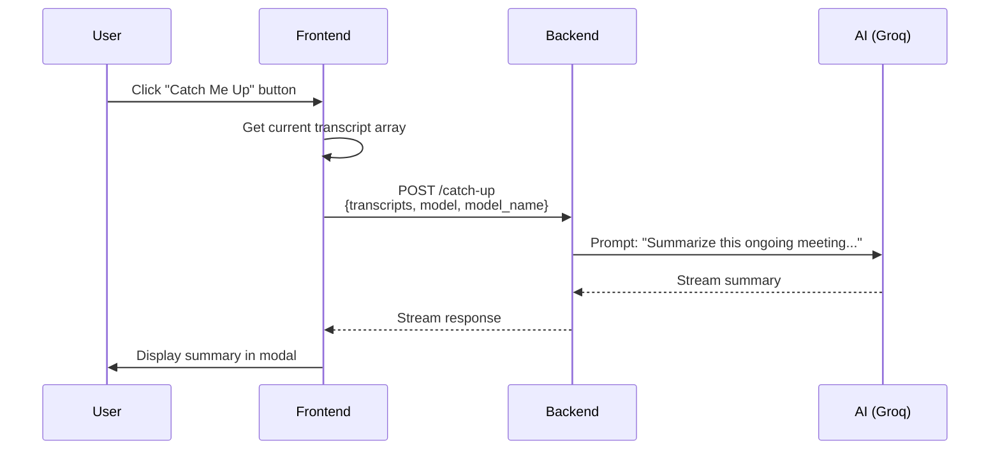

# Catch Me Up Feature

## Overview

**Catch Me Up** is a real-time summary feature that allows users to get instant AI-generated summaries of an ongoing meeting without interrupting the flow of conversation.

## Use Cases

- **Late Joiners**: Get caught up on what you missed
- **Quick Status Check**: Understand what's been discussed so far
- **Meeting Handoff**: Brief summary before changing note-takers
- **Context Refresh**: Re-orient yourself if you got distracted

## How It Works

### User Flow



### Technical Implementation

**1. Frontend (`MeetingDetails/index.tsx`)**
```typescript
const handleCatchUp = async () => {
    const response = await fetch('/catch-up', {
        method: 'POST',
        headers: { 'Content-Type': 'application/json' },
        body: JSON.stringify({
            transcripts: transcripts.map(t => t.text),  // ["hello", "how are you", ...]
            model: 'groq',
            model_name: 'llama-3.3-70b-versatile'
        })
    });
    
    // Stream response into modal
    const reader = response.body.getReader();
    // ...
};
```

**2. Backend (`main.py`)**
```python
@app.post("/catch-up")
async def catch_up(request: CatchUpRequest):
    # Combine all transcript segments
    full_text = "\n".join(request.transcripts)
    
    # Generate summary using AI
    prompt = f"""
    The following is a transcript of an ongoing meeting. 
    Provide a concise summary of what has been discussed so far:
    
    {full_text}
    """
    
    # Stream response from Groq
    stream = await groq_client.chat_stream(prompt, request.model_name)
    return StreamingResponse(stream, media_type="text/plain")
```

## Features

### Current Implementation
- ✅ Real-time summarization of live meetings
- ✅ Streaming response (no waiting for full summary)
- ✅ Works with any ongoing meeting
- ✅ No meeting context required (standalone feature)

### Limitations
- ⚠️ Only summarizes current meeting (doesn't search past meetings)
- ⚠️ Limited to ~8k tokens (~32k characters of transcript)
- ⚠️ No persistent storage of summaries

## Usage Tips

**Best Practices**:
1. **Use Early**: Click "Catch Me Up" within first 10-15 minutes for quick orientation
2. **Not a Replacement**: Still generates full meeting summary at the end
3. **Quick Refreshes**: Use multiple times during long meetings (>1 hour)

**Example Outputs**:

**Short Meeting (5 min)**:
> "The team discussed Q4 budget allocation. Sarah proposed $50k for..."

**Long Meeting (30 min)**:
> "Key topics covered:
> 1. Budget Review - Approved $50k marketing spend
> 2. Product Roadmap - Delayed feature X to Q2
> 3. Hiring Updates - 3 new candidates in pipeline"

## Token & Performance

**Token Usage**:
- Input: ~2,000 tokens (typical 10-minute meeting)
- Output: ~300-500 tokens (summary)
- Total: ~2,500 tokens per request

**Response Time**:
- Streaming starts: ~500ms
- Full summary: ~3-5 seconds

## API Reference

### Endpoint
```
POST /catch-up
```

### Request Body
```json
{
    "transcripts": ["hello", "how are you", "..."],
    "model": "groq",
    "model_name": "llama-3.3-70b-versatile"
}
```

### Response
```
Content-Type: text/plain
Transfer-Encoding: chunked (streaming)

The team has been discussing...
```

## Future Enhancements

### Planned
- [ ] Include linked meeting context in summaries
- [ ] Persistent summary storage in database
- [ ] Multi-language support
- [ ] Customizable summary length (brief/detailed)

### Under Consideration
- [ ] Auto-generate summaries at intervals (every 15 min)
- [ ] Email summaries to late joiners
- [ ] Sentiment analysis in summaries
