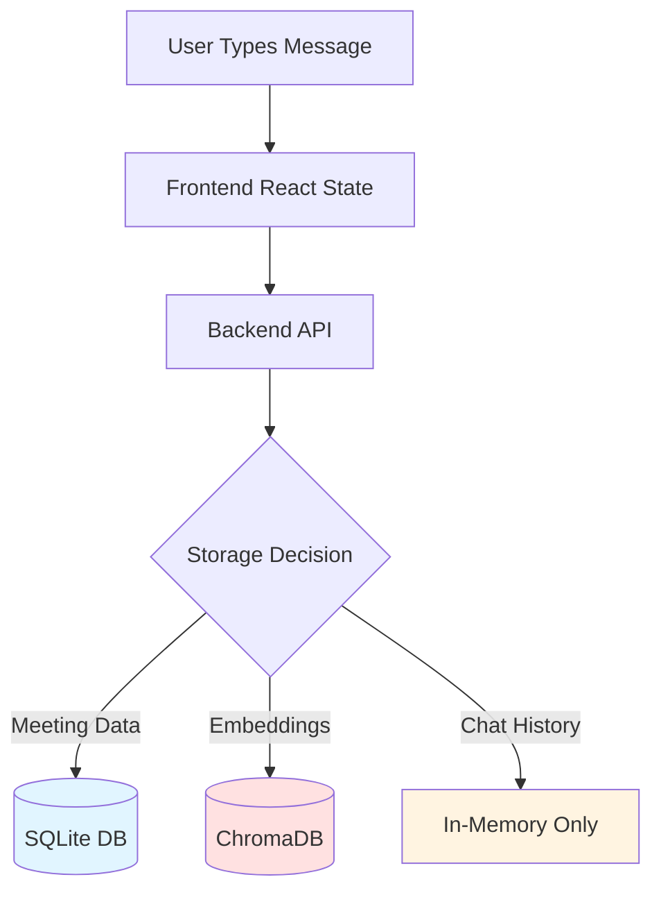
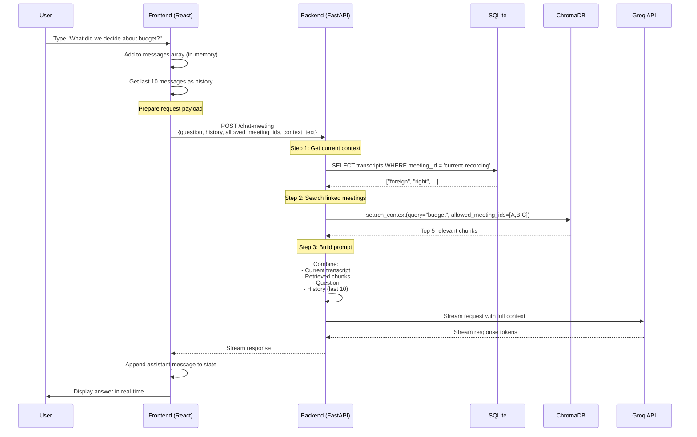

# Complete Chat Memory Architecture - A to Z

## 🗄️ Storage Layers Overview

Your system uses **THREE separate storage layers** for different purposes:



---

## 📦 Layer 1: SQLite Database (Persistent)

**Location**: `/app/data/meeting_minutes.db` (inside Docker)

**What's Stored**:
- Meeting metadata (title, date, ID)
- Raw transcripts (text + timestamps)
- Audio file references
- Summary results

**Schema Relevant to Chat**:
```sql
-- Meetings table
CREATE TABLE meetings (
    id TEXT PRIMARY KEY,
    title TEXT,
    created_at TEXT,
    updated_at TEXT
);

-- Transcripts table (the actual words spoken)
CREATE TABLE transcripts (
    id INTEGER PRIMARY KEY,
    meeting_id TEXT,
    transcript TEXT,          -- "Hello, let's discuss Q4 budget..."
    timestamp TEXT,
    audio_start_time REAL,
    audio_end_time REAL
);
```

**What ISN'T Stored**: Chat conversations (Q&A pairs)

---

## 🧠 Layer 2: ChromaDB Vector Store (Persistent)

**Location**: `/app/data/chromadb/` (inside Docker)

**What's Stored**:
- **Embeddings**: Vector representations of transcript chunks
- **Metadata**: `meeting_id`, `meeting_title`, `meeting_date`, `chunk_index`
- **Original Text**: The actual chunk text for retrieval

**Data Structure**:
```python
# Example of ONE document in ChromaDB:
{
    "id": "meeting-123_chunk_0",
    "embedding": [0.234, -0.112, 0.567, ...],  # 384-dimensional vector
    "document": "We decided to allocate $50k for marketing in Q4...",
    "metadata": {
        "meeting_id": "meeting-123",
        "meeting_title": "Q4 Planning",
        "meeting_date": "2026-01-05",
        "chunk_index": 0,
        "total_chunks": 5
    }
}
```

**Chunking Strategy**:
- Chunk size: **500 characters**
- Overlap: **100 characters** (to preserve context at boundaries)
- Why? LLMs have token limits; smaller chunks = better retrieval

**Current Data**:
- **90 chunks** from **8 meetings**
- Average ~11 chunks per meeting

---

## 💬 Layer 3: Chat Memory (In-Memory, Ephemeral)

**Location**: Frontend React state (`ChatInterface.tsx`)

**What's Stored**:
```typescript
const [messages, setMessages] = useState<Message[]>([
    { role: 'user', content: "What were the key decisions?" },
    { role: 'assistant', content: "Based on Q4 Planning meeting..." },
    { role: 'user', content: "What about Q3?" },
    // ...
]);
```

**Storage Duration**: **Until page refresh** (no backend persistence)

**Memory Limit**: **Last 10 messages** (5 user + 5 assistant)

---

## 🔄 Complete Conversation Flow

### Step-by-Step: User Asks a Question



---

## 📝 Chat Memory: The Details

### Frontend Implementation (`ChatInterface.tsx`)

```typescript
const handleSendMessage = async (content: string) => {
    // 1. Add user message to local state
    const userMessage = { role: 'user', content };
    const newMessages = [...messages, userMessage];
    setMessages(newMessages);
    
    // 2. Prepare history (last 10 messages)
    const recentHistory = newMessages.slice(-10).map(msg => ({
        role: msg.role,
        content: msg.content
    }));
    
    // 3. Send to backend
    const response = await fetch('/chat-meeting', {
        method: 'POST',
        body: JSON.stringify({
            meeting_id: currentMeetingId,
            question: content,
            model: 'groq',
            model_name: 'llama-3.3-70b-versatile',
            context_text: currentTranscript,           // Real-time audio
            allowed_meeting_ids: linkedMeetingIds,     // Linked context
            history: recentHistory                     // Chat memory ✅
        })
    });
    
    // 4. Stream response and add to state
    const assistantMessage = { role: 'assistant', content: streamedText };
    setMessages([...newMessages, assistantMessage]);
};
```

**Key Points**:
- ✅ Chat history is sent with EVERY request
- ✅ Only last 10 messages sent (to save tokens)
- ❌ Not persisted to database
- ❌ Lost on page refresh

---

## 🧮 Token Limits and Memory Management

### The Math Behind Memory Limits

**1 Token ≈ 4 characters** (rough estimate)

**Groq `llama-3.3-70b-versatile` Limits**:
- Total context window: **131,072 tokens** (~524k characters) 
- Rate limit: 6,000 tokens per minute (free tier)

**Example Calculation** (with upgraded model):

```
Current Meeting Transcript:       2,000 characters  (500 tokens)
Retrieved Chunks (10 × 500 chars): 5,000 characters  (1,250 tokens)
Last 50 Chat Messages (avg):     20,000 characters  (5,000 tokens)
System Prompt:                     1,200 characters  (300 tokens)
User Question:                       200 characters  (50 tokens)
-------------------------------------------------------------------
TOTAL INPUT:                      28,400 characters  (7,100 tokens)
AI Response (max):                ~4,000 tokens
-------------------------------------------------------------------
TOTAL USAGE:                      ~11,100 tokens (within 128k limit ✅)
```

**Why Limit to 50 Messages?**
- Balances conversation depth with performance
- Still well under 128k token limit
- Allows for complex, multi-turn discussions

**What Happens if You Exceed 128k Tokens?**
- Very rare with current limits (would need ~500+ messages)
- Groq API returns error: `context_length_exceeded`
- Backend catches error: `HTTPException(400, detail="Context too large")`
- Frontend shows: "Sorry, I encountered an error..."

---

## 🔍 Search Context Retrieval

### How ChromaDB Finds Relevant Chunks

**Vector Similarity Search**:
```python
# Your question
query = "What did we decide about budget?"

# Step 1: Convert to embedding vector
query_embedding = embedding_model.encode(query)
# Result: [0.123, -0.456, 0.789, ...]

# Step 2: Search ChromaDB
results = collection.query(
    query_embeddings=[query_embedding],
    n_results=5,                              # Top 5 matches
    where={"meeting_id": {"$in": [A, B, C]}}  # Scoped filter
)

# Step 3: ChromaDB computes cosine similarity
# Returns chunks with highest similarity scores
```

**Cosine Similarity** (simplified):
- Measures angle between query vector and document vectors
- Range: -1 (opposite) to +1 (identical)
- Threshold typically ~0.5 for relevance

**Example Results**:
```python
[
    {
        "document": "We decided to allocate $50k for Q4 marketing...",
        "metadata": {"meeting_id": "meeting-A", "meeting_title": "Q4 Planning"},
        "distance": 0.23  # Lower = more similar
    },
    {
        "document": "Budget approval was unanimous for the $50k spend...",
        "metadata": {"meeting_id": "meeting-B", "meeting_title": "Finance Review"},
        "distance": 0.31
    },
    # ... 3 more chunks
]
```

---

## 📊 Memory Persistence Summary

| Data Type | Storage | Persists After | Limit |
|-----------|---------|----------------|-------|
| **Meeting Transcripts** | SQLite | Forever | Disk space |
| **Embeddings** | ChromaDB | Forever | Disk space |
| **Chat Conversations** | React State | Page refresh | 50 messages |
| **Linked Meeting IDs** | React State | Page refresh | Unlimited |
| **Current Transcript** | React State | Page refresh | ~2-5MB |

---

## 🚀 Optimizations & Trade-offs

### Current Design Choices

**1. No Chat Persistence**
- ✅ **Pros**: Simpler architecture, no database writes
- ❌ **Cons**: Can't resume conversations after refresh

**2. 50-Message History Limit**
- ✅ **Pros**: Deep conversation context, well under 128k limit
- ✅ **Pros**: Better multi-turn reasoning
- ❌ **Cons**: Slightly more data transferred per request

**3. 10-Chunk Retrieval**
- ✅ **Pros**: Comprehensive context from past meetings
- ✅ **Pros**: Better answers for complex queries
- ⚠️ **Cons**: Requires careful query to get relevant chunks

### Potential Upgrades

**To Enable Persistent Chat**:
```sql
CREATE TABLE chat_sessions (
    id TEXT PRIMARY KEY,
    meeting_id TEXT,
    created_at TEXT
);

CREATE TABLE chat_messages (
    id INTEGER PRIMARY KEY,
    session_id TEXT,
    role TEXT,           -- 'user' or 'assistant'
    content TEXT,
    timestamp TEXT,
    FOREIGN KEY (session_id) REFERENCES chat_sessions(id)
);
```

**To Increase Memory Without Token Overflow**:
- Use **summarization**: Summarize old messages, keep only summary
- **Sliding window**: Keep first 2 + last 8 messages
- **Hybrid**: Store full history in DB, send condensed version to LLM

---

## 🔐 Data Flow Security & Privacy

**What Gets Sent to Groq API**:
- ✅ Your question
- ✅ Retrieved meeting chunks (only linked meetings)
- ✅ Last 10 messages
- ❌ NOT full database (only relevant excerpts)
- ❌ NOT all 38 meetings (only what you link)

**Data Retention**:
- **Local (Your Server)**: Forever in SQLite + ChromaDB
- **Groq Cloud**: 30 days (their policy), then deleted
- **Chat History**: Browser session only (not sent to Groq in future requests)

---

## 📈 Scalability Limits

| Metric | Current | Theoretical Max | Bottleneck |
|--------|---------|-----------------|------------|
| **Meetings** | 38 | ~10,000 | ChromaDB performance |
| **Chunks** | 90 | ~1,000,000 | Disk space |
| **Chat History** | 10 msgs | ~50-100 msgs | LLM token limit |
| **Linked Meetings** | Unlimited | ~20-30 | Token limit |
| **Concurrent Users** | 1 | ~100 | FastAPI + Docker resources |

---

## 🎯 Key Takeaways

1. **Three Storage Layers**: SQLite (transcripts), ChromaDB (embeddings), React (chat)
2. **Chat Memory Limit**: 10 messages, in-memory only
3. **Token Budget**: ~2,500 tokens for context, ~4,000 for response
4. **Search Limit**: Top 5 chunks from linked meetings
5. **Persistence**: Transcripts persist, chat doesn't
6. **Privacy**: Only selected meeting chunks sent to Groq

**Current Workflow** (simplified):
```
User asks question
  → Frontend sends: question + last 10 messages + linked meeting IDs
    → Backend searches ChromaDB for top 5 relevant chunks
      → Combines chunks + current transcript + history
        → Sends to Groq API
          → Streams response back to user
            → User sees answer (added to in-memory state)
```
