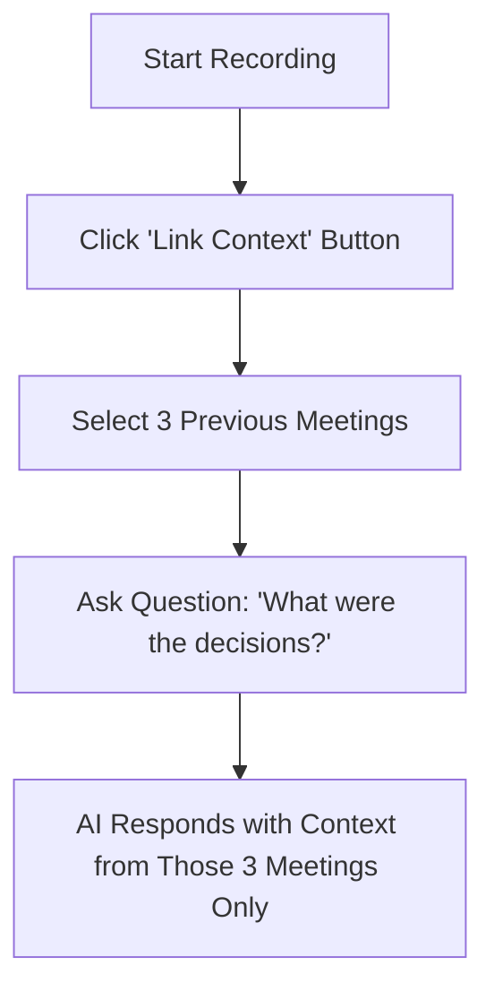
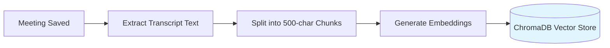
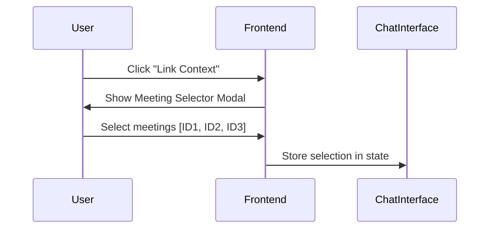
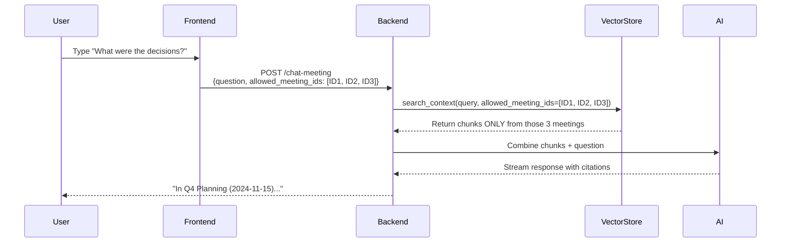
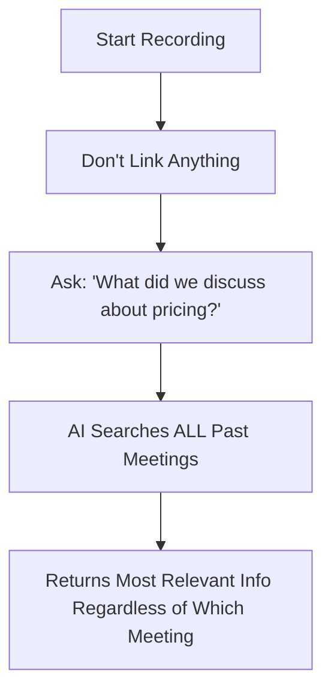
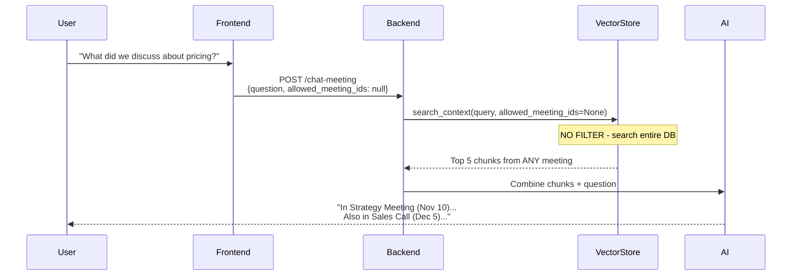
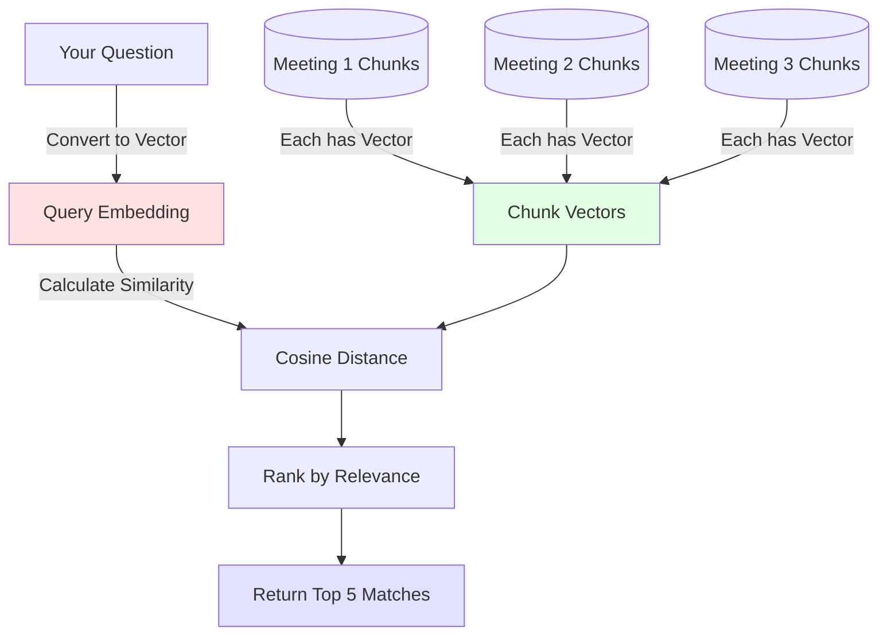
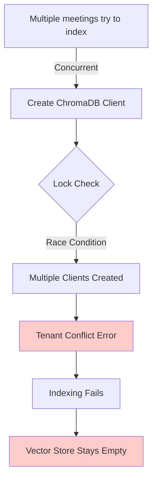

# Meeting Context Search - How It Works

## Overview

Your meeting co-pilot has two modes for answering questions about meetings:

1. **Scoped Search** (when you link specific meetings)
2. **Global Search** (when you don't link any meetings)

---

## 🔗 Scenario 1: Linking Previous Meetings

### User Workflow


### Technical Flow

#### Step 1: Meeting Storage (Background Process)


**What happens:**
- Every saved meeting is broken into ~500 character chunks
- Each chunk is converted to a vector (mathematical representation)
- Stored in ChromaDB with metadata: `meeting_id`, `meeting_title`, `meeting_date`

#### Step 2: User Links Meetings


**What happens:**
- `MeetingSelector.tsx` fetches all available meetings via `/list-meetings`
- User checks boxes for meetings they want included
- `ChatInterface.tsx` stores the selected IDs in `linkedMeetingIds` state

#### Step 3: User Asks Question


**What happens:**
1. Frontend sends `allowed_meeting_ids: ["meeting-123", "meeting-456", "meeting-789"]`
2. Backend calls `vector_store.search_context()` with filter:
   ```python
   where={"meeting_id": {"$in": ["meeting-123", "meeting-456", "meeting-789"]}}
   ```
3. ChromaDB returns the 5 most relevant chunks **only from those 3 meetings**
4. AI sees:
   ```
   Current Meeting Context: [empty or live transcript]
   
   Relevant Past Meeting Context:
   - [Q4 Planning (2024-11-15)]: "We decided to prioritize feature X..."
   - [Budget Review (2024-11-10)]: "Approved $50k for marketing..."
   ```
5. AI generates response and cites sources

---

## 🌐 Scenario 2: NO Linked Meetings (Global Search)

### User Workflow


### Technical Flow



**What happens:**
1. Frontend omits `allowed_meeting_ids` (or sends `null`)
2. Backend calls `search_context()` with **no filter**
3. ChromaDB searches across **all 38 meetings** in the database
4. Returns the 5 most semantically similar chunks regardless of which meeting they came from
5. AI can pull context from multiple different meetings in a single response

---

## 🔍 How Semantic Search Works

### Example Query: "What were the key decisions?"



**Not Simple Text Matching:**
- Doesn't just search for the word "decisions"
- Understands that "decisions", "conclusions", "resolutions", "agreed" are semantically similar
- Finds relevant content even if exact words don't match

---

## 📊 Current State & The Bug

### Why It's Not Working Right Now



**The Issue:**
- When bulk re-indexing 38 meetings, multiple async calls try to initialize ChromaDB
- Even with thread locks, the persistent client has internal state that conflicts
- Result: Only 1 meeting gets indexed successfully

### What Works vs What Doesn't

✅ **Works:**
- Saving individual new meetings (one at a time)
- Chat interface (UI)
- Meeting selection (UI)

❌ **Broken:**
- Bulk re-indexing past meetings
- Searching context from those past meetings
- Citations from previous meetings

---

## 🛠️ The Fix (In Progress)

### Option 1: Sequential Indexing
Process meetings one at a time instead of in parallel:
```python
for meeting in meetings:
    await store_meeting_embeddings(meeting)  # One at a time
    await asyncio.sleep(0.1)  # Small delay
```

### Option 2: Better Singleton
Ensure ChromaDB client is truly initialized only once globally:
```python
_client_init_complete = threading.Event()
# Wait for initialization if another thread started it
```

---

## 📖 Summary

| Scenario | Filter Applied | Search Scope | Example |
|----------|---------------|--------------|---------|
| **Linked 3 meetings** | `allowed_meeting_ids=[A,B,C]` | Only those 3 meetings | "What did we decide?" → searches only A, B, C |
| **No links** | `allowed_meeting_ids=None` | All 38 meetings | "What did we decide?" → searches everything |
| **Live meeting only** | Empty context | Current transcript | "What did I just say?" → only current session |

**Key Insight:** The system is designed to be flexible - you can scope your search narrowly (link specific meetings) or broadly (search everything), depending on your needs.
