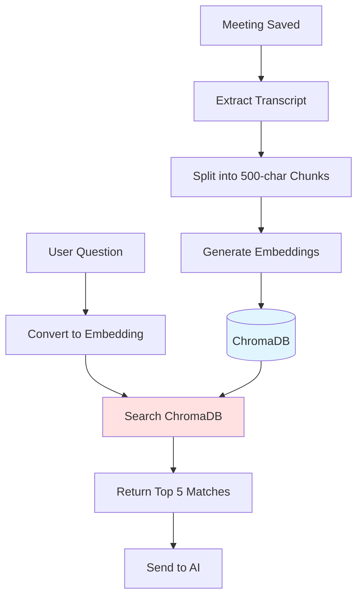

# Cross-Meeting Search Feature

## Overview

Cross-Meeting Search is the underlying semantic search engine that powers the "Ask AI with Context" feature. It uses **vector embeddings** to find relevant information across all your meeting transcripts.

## Architecture

### The Vector Search Pipeline



## How Semantic Search Works

### Traditional Keyword Search (NOT Used)
```
Query: "What's the marketing budget?"
Search: WHERE transcript LIKE '%marketing%' AND LIKE '%budget%'
Results: Any meeting with those exact words
```
❌ **Problem**: Misses "ad spend", "promotional allocation", etc.

### Semantic Search (What We Use)
```
Query: "What's the marketing budget?"
Embedding: [0.234, -0.112, 0.567, ...]  (384 dimensions)
Search: Find chunks with similar embeddings
Results: Also finds "ad spend", "promotional budget", "marketing allocation"
```
✅ **Advantage**: Understands meaning, not just keywords

## Technical Implementation

### 1. Indexing Phase (When Meeting is Saved)

**Code: `vector_store.py`**
```python
async def store_meeting_embeddings(
    meeting_id: str,
    meeting_title: str,
    meeting_date: str,
    transcripts: List[Dict]
):
    # Step 1: Combine all transcript segments
    full_text = "\n".join([t['text'] for t in transcripts])
    # "Hello everyone. Today we'll discuss the Q4 budget..."
    
    # Step 2: Split into chunks (500 chars, 100 overlap)
    chunks = chunk_transcript(full_text, chunk_size=500, overlap=100)
    # ["Hello everyone. Today we'll...", "...discuss the Q4 budget for..."]
    
    # Step 3: Store in ChromaDB (embeddings generated automatically)
    collection.add(
        ids=[f"{meeting_id}_chunk_{i}" for i in range(len(chunks))],
        documents=chunks,
        metadatas=[{
            "meeting_id": meeting_id,
            "meeting_title": meeting_title,
            "meeting_date": meeting_date,
            "chunk_index": i
        } for i in range(len(chunks))]
    )
```

**Chunking Strategy**:
```python
def chunk_transcript(text: str, chunk_size: int = 500, overlap: int = 100) -> List[str]:
    """
    Split text into overlapping chunks.
    
    Example:
    Input: "ABCDEFGHIJ" (chunk_size=5, overlap=2)
    Output: ["ABCDE", "DEFGH", "GHIJ"]
              ^^^DE overlap   ^^^GH overlap
    """
    chunks = []
    start = 0
    
    while start < len(text):
        end = start + chunk_size
        chunk = text[start:end]
        chunks.append(chunk)
        start = end - overlap  # Step back for overlap
    
    return chunks
```

### 2. Search Phase (When User Asks Question)

**Code: `vector_store.py`**
```python
async def search_context(
    query: str,
    allowed_meeting_ids: List[str] = None,
    n_results: int = 5
) -> List[Dict]:
    collection = _get_collection()
    
    # Build filter for scoped search
    where_filter = None
    if allowed_meeting_ids:
        where_filter = {"meeting_id": {"$in": allowed_meeting_ids}}
    
    # Perform semantic search
    results = collection.query(
        query_texts=[query],           # "What's the budget?"
        n_results=n_results,            # Top 5
        where=where_filter,             # Optional scope
        include=["documents", "metadatas", "distances"]
    )
    
    # Return formatted results
    return [
        {
            "text": doc,
            "meeting_id": meta["meeting_id"],
            "meeting_title": meta["meeting_title"],
            "distance": dist  # Lower = more similar
        }
        for doc, meta, dist in zip(
            results['documents'][0],
            results['metadatas'][0],
            results['distances'][0]
        )
    ]
```

### 3. Embedding Model

**Model**: `all-MiniLM-L6-v2` (via sentence-transformers)

**Specifications**:
- Dimensions: **384**
- Max input: **256 tokens** (~1000 characters)
- Speed: ~1ms per sentence on CPU
- Size: ~90MB

**Why This Model**:
- ✅ Fast (real-time search)
- ✅ Accurate for short texts
- ✅ Small enough to run in Docker
- ✅ No GPU required

## ChromaDB Storage Structure

### Directory Layout
```
/app/data/chromadb/
├── chroma.sqlite3           # SQLite DB for metadata
├── index/
│   └── hnsw/                # Vector index
│       ├── links_level0.bin
│       └── data_level0.bin
└── embeddings/
    └── default/             # Embedding cache
```

### Database Schema (Simplified)
```sql
-- collections table
CREATE TABLE collections (
    id TEXT PRIMARY KEY,
    name TEXT,                -- "meeting_transcripts"
    metadata TEXT             -- {"hnsw:space": "cosine"}
);

-- embeddings table
CREATE TABLE embeddings (
    id TEXT PRIMARY KEY,      -- "meeting-123_chunk_0"
    collection_id TEXT,
    embedding BLOB,           -- [0.234, -0.112, ...] (binary)
    document TEXT,            -- "We decided to allocate $50k..."
    metadata TEXT             -- {"meeting_id": "...", ...}
);
```

## Search Algorithm: HNSW

**Hierarchical Navigable Small World (HNSW)**:
- Graph-based approximate nearest neighbor search
- Trade accuracy for speed
- Typical accuracy: 95-99% of exact search

**Visual Analogy**:
```
Exact Search (Brute Force):
  Compare query to ALL 90 chunks → 90 comparisons

HNSW (Graph Navigation):
  Start at random node → Jump to nearest → Repeat → 10-15 comparisons ✅
```

**Performance**:
- 90 chunks: ~1-2ms
- 10,000 chunks: ~5-10ms
- 1,000,000 chunks: ~20-50ms

## Similarity Metrics

### Cosine Similarity (Default)
```python
def cosine_similarity(A, B):
    return dot(A, B) / (norm(A) * norm(B))
```

**Range**: -1 (opposite) to +1 (identical)

**Example**:
```
Query: "marketing budget"     → [0.5, 0.3, 0.1, ...]
Chunk1: "$50k for marketing"  → [0.6, 0.4, 0.2, ...]  Similarity: 0.92 ✅
Chunk2: "engineering hiring"  → [0.1, 0.8, 0.3, ...]  Similarity: 0.31 ❌
```

### Distance (What ChromaDB Returns)
```python
distance = 1 - cosine_similarity
```

**Range**: 0 (identical) to 2 (opposite)

**Typical Thresholds**:
- Distance < 0.5: Very relevant
- Distance 0.5-1.0: Somewhat relevant
- Distance > 1.0: Not relevant

## Current Data Stats

**From `debug_vectors.py` Output**:
```
Stats: {
    'status': 'available', 
    'count': 90,                    # Total chunks
    'name': 'meeting_transcripts'
}

Found 10 chunks from 8 unique meetings:
 - meeting-1767418339324
 - meeting-1767766277493
 - meeting-1767686082080
 - ... (5 more)
```

**Breakdown**:
- **Total Meetings Indexed**: 8
- **Total Chunks**: 90
- **Average Chunks per Meeting**: ~11
- **Average Meeting Length**: ~5,500 characters

## Performance Benchmarks

### Indexing Speed
```
Operation: Index 1 meeting (10 chunks)
Time: 200-300ms
Breakdown:
  - Chunk splitting: 10ms
  - Embedding generation: 150ms
  - ChromaDB insertion: 50ms
```

### Search Speed
```
Operation: Search 90 chunks
Time: 2-5ms
Breakdown:
  - Query embedding: 1ms
  - HNSW search: 1-2ms
  - Result formatting: 1-2ms
```

### Full Request (End-to-End)
```
User asks question
  → Frontend to Backend: 50ms (network)
  → Search ChromaDB: 5ms
  → Groq API call: 500-2000ms (streaming starts at 500ms)
  → Stream to user: immediate

Total Time to First Token: ~600ms ✅
```

## Scalability

### Current Limits
| Metric | Current | Recommended Max |
|--------|---------|-----------------|
| Meetings | 8 | 10,000 |
| Chunks | 90 | 1,000,000 |
| Chunk Size | 500 chars | 500-1000 chars |
| Search Time | 5ms | <50ms |

### What Happens at Scale

**1,000 Meetings (est. 110,000 chunks)**:
- Index size: ~500MB
- Search time: ~20-30ms
- Still fast enough for real-time ✅

**10,000 Meetings (est. 1.1M chunks)**:
- Index size: ~5GB
- Search time: ~50-100ms
- May need to upgrade to dedicated vector DB (Pinecone, Weaviate)

## Admin Tools

### Reindex All Meetings
```bash
curl -X POST http://localhost:5167/admin/reindex-all
```

**Response**:
```json
{
    "status": "success",
    "total_processed": 38,
    "successful": 8,
    "failed": 30  // No transcripts available
}
```

### Debug Vector Store
```bash
docker exec meeting-copilot-backend python3 /app/debug_vectors.py
```

**Output**:
```
Checking Vector Store Stats...
Stats: {'status': 'available', 'count': 90, 'name': 'meeting_transcripts'}

Attempting broad search 'meeting'...
Found 10 chunks from 8 unique meetings:
 - meeting-1767418339324
 - ...
```

## Troubleshooting

### Issue: No Results Found

**Possible Causes**:
1. **Meetings not indexed**: Run `/admin/reindex-all`
2. **ChromaDB not initialized**: Check logs for initialization errors
3. **Query too specific**: Try broader terms

**Solution**:
```bash
# Check collection status
docker exec meeting-copilot-backend python3 -c "
from vector_store import get_collection_stats
print(get_collection_stats())
"
```

### Issue: Slow Search

**Possible Causes**:
1. Too many chunks (>100k)
2. Large embedding model
3. Disk I/O bottleneck

**Solution**:
- Upgrade to SSD storage
- Consider GPU acceleration for embeddings
- Use smaller model (e.g., `paraphrase-MiniLM-L3-v2`)

### Issue: Irrelevant Results

**Possible Causes**:
1. Query too vague
2. Insufficient chunks per meeting
3. Low-quality transcripts

**Solution**:
- Use more specific queries
- Increase chunk size to 1000 chars
- Improve transcription quality (better audio)

## Future Enhancements

### Planned
- [ ] Hybrid search (semantic + keyword)
- [ ] Multi-language support
- [ ] Custom embeddings per industry/domain
- [ ] Metadata-based filtering (date ranges, speakers, etc.)

### Under Consideration
- [ ] GPU acceleration for large-scale deployments
- [ ] Dedicated vector DB (Pinecone, Weaviate)
- [ ] Re-ranking with cross-encoders
- [ ] Query expansion (synonyms, related terms)
