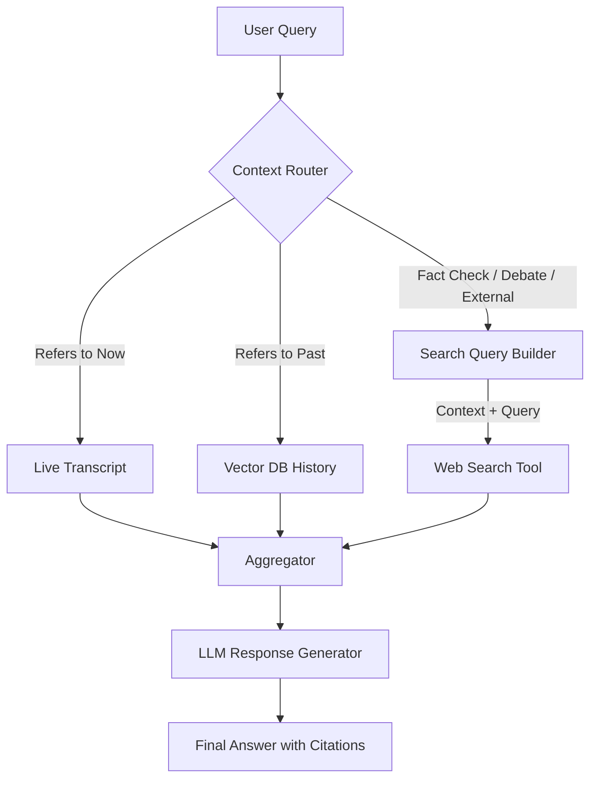

# Context-Aware Meeting Chatbot with Web Search: Design Document

## 1. Overview

The **Context-Aware Meeting Chatbot with Web Search** is an advanced AI assistant feature designed to run alongside active meetings. Unlike standard transcription bots that only "know" what has been said in the current session, this system integrates three critical knowledge sources:

1.  **Live Meeting Context:** Real-time access to the ongoing discussion.
2.  **Historical Context:** Access to previous meetings, decisions, and action items.
3.  **External Web Intelligence:** On-demand access to live web data to resolve debates, fact-check claims, and provide up-to-date information not found in internal logs.

### Why this is being added
Meetings often stall due to "knowledge gaps" or factual disagreements (debates). Participants waste time searching for data or arguing over verifiable facts. This feature aims to:
*   **Resolve Debates Instantly:** Provide objective, third-party data when participants disagree.
*   **Bridge Context:** Connect current discussions to past decisions.
*   **Enhance Accuracy:** Reduce hallucinations by grounding answers in retrieved evidence (both internal and external) rather than the LLM's static training data.

---

## 2. High-Level Architecture

The architecture utilizes a **Router-based RAG (Retrieval-Augmented Generation)** approach. A central "Context Router" determines which layers of information are needed to answer a specific user query.

### 2.1 Context Layers

The system is organized into four hierarchical layers:

| Layer | Name | Source | Use Case |
| :--- | :--- | :--- | :--- |
| **L1** | **Chat Memory** | In-memory Session | Handling follow-ups (e.g., "Elaborate on that"). |
| **L2** | **Current Meeting** | Sliding Window Buffer / Live Vector Index | "What did Alice just say?", "Summarize the last 5 mins". |
| **L3** | **Historical Knowledge** | Vector Database (PGVector) | "What did we decide last week?", "Do we have a budget for this?" |
| **L4** | **Web Search** | External Search Tool API (e.g., Tavily, Google) | Fact-checking, market data, debate resolution, checking competitor info. |

### 2.2 Architecture Diagram

### 2.3 Context Resolution Order
1.  **Direct Answer:** If L1 (Chat Memory) is sufficient, answer immediately.
2.  **Internal Retrieval:** If the query relates to internal knowledge, query L2 and L3 in parallel.
3.  **Gap Analysis / Trigger:** If internal retrieval is insufficient (low confidence) OR if the query explicitly requires external data, trigger L4 (Web Search).

---

## 3. Web Search Integration

Web search is not a default action; it is a **tool** invoked by the system under specific conditions to preserve privacy and reduce latency.

### 3.1 Trigger Logic: When to Search?
The system invokes the Web Search Tool in the following scenarios:
1.  **Explicit Intent:** User asks "Search for..." or "Google X".
2.  **Debate Detection:** The system detects conflicting factual claims in the live transcript (e.g., Speaker A says "Interest rates are 5%", Speaker B says "No, they are 2%").
3.  **Missing Knowledge:** The LLM analyzes the query and determines it cannot be answered with internal context (e.g., "What is the current stock price of Apple?").
4.  **Verification:** User asks "Is that true?" regarding a specific claim made in the meeting.

### 3.2 Query Construction
The **Search Query Builder** uses the user's question *plus* the relevant meeting context to create an effective search string.

*   **Scenario:** Meeting is about "Project Alpha". User asks "Who are the competitors?"
*   **Bad Query:** "competitors"
*   **Constructed Query:** "Project Alpha software competitors list 2024"

*   **Scenario (Debate):** Speaker A says "The GDP grew 3%". User asks "Is he right?"
*   **Constructed Query:** "US GDP growth rate Q3 2024 official statistics"

### 3.3 Prioritization & Citation
*   **Priority:**
    *   For **Internal Policies/Decisions**: Internal Context (L3) > Web (L4).
    *   For **Public Facts/Data**: Web (L4) > Internal Context (L2/L3).
*   **Representation:**
    *   Web results must be distinct from internal knowledge.
    *   **Citation Style:** "According to [Source Domain] [1], the value is X..."
    *   **Conflict:** If Web contradicts Meeting, state clearly: *"Speaker A mentioned X, but external sources [1] suggest Y."*

---

## 4. Retrieval Strategy

The system uses a **Hybrid Retrieval Strategy**:

1.  **Decomposition:** The User Query is decomposed into sub-tasks.
    *   *Query:* "Does our budget cover the new pricing for AWS?"
    *   *Sub-task 1 (Internal):* Retrieve "current budget" from L3.
    *   *Sub-task 2 (External):* Retrieve "current AWS pricing" from L4.
2.  **Parallel Execution:** Sub-tasks are executed concurrently.
3.  **Re-ranking:** Retrieved chunks (text from transcripts, snippets from web) are re-ranked based on semantic relevance to the original query.
4.  **Context Window Injection:** The top-k results from both sources are injected into the LLM's system prompt.

---

## 5. Answer Logic

The LLM generates the final response using a strict "Evidence-Based" instruction set:

1.  **Source Identification:** Identify which piece of context (Internal vs External) answers which part of the user's question.
2.  **Synthesis:** Combine the information.
3.  **Grounding:** Every factual claim must have a reference.
    *   *Format:* `[Meeting @ 10:15]` for internal.
    *   *Format:* `[source-domain.com]` for external.
4.  **Uncertainty:** If neither internal nor external sources provide an answer, admit ignorance. Do not hallucinate.

---

## 6. Safety & Accuracy

### 6.1 Hallucination Prevention
*   **Strict Context Only:** The LLM is instructed to answer *only* using the provided retrieved context.
*   **Web Verification:** Web search serves as a "fact-checker" for the LLM's internal knowledge base, reducing the likelihood of outdated info.

### 6.2 Privacy & Scope
*   **PII Filtering:** The Query Builder must strip Personally Identifiable Information (names, emails) from the meeting transcript before sending queries to public search engines.
    *   *Input:* "Is John Doe's email address valid?"
    *   *Sanitized Query:* "email address syntax validation"
*   **Scope Leakage:** Web search results are ephemeral and never stored in the permanent VectorDB (L3) to prevent polluting the company's private knowledge base with public internet data.

---

## 7. Metrics

To evaluate the success of this feature, we will track:

| Metric | Definition | Goal |
| :--- | :--- | :--- |
| **Debate Resolution Rate** | % of detected debates where a web search provided a definitive answer. | > 70% |
| **Source Relevance** | % of web search results deemed "useful" by the LLM (used in the final answer). | > 60% |
| **Citation Accuracy** | % of generated claims that correctly cite the source provided in context. | > 95% |
| **Latency** | Total time from Query to Answer (including Search). | < 4.0s |
| **Hallucination Rate** | Rate of answers containing facts not present in L2, L3, or L4. | < 2% |

---

## 8. Examples

### Example 1: Fact Checking (Debate)
**Context:** Two engineers disagree on the context limit of a specific model.
*   **Transcript:**
    *   *Alice:* "Llama-3 has a 8k limit."
    *   *Bob:* "No, I think it's 128k now."
*   **User Question:** "Who is right about the context limit?"
*   **Action:** System triggers Web Search.
*   **Query:** "Llama-3 context window size specifications"
*   **Result:** Web result says "Llama-3 supports up to 128k context."
*   **Answer:** "Bob is correct. According to official release notes [meta.ai], Llama-3 supports a context window of 128k, whereas Alice mentioned 8k."

### Example 2: Hybrid Context
**Context:** Meeting about the marketing budget for Q3.
*   **User Question:** "Can we afford the new SuperBowl ad spot?"
*   **Action:** System performs Hybrid Retrieval.
*   **Internal Search:** Retrieves Q3 Marketing Budget ($500k).
*   **Web Search:** Retrieves "SuperBowl 2024 ad spot average cost" ($7M).
*   **Answer:** "Likely not. Based on internal records, our Q3 budget is **$500k** [Meeting History], but external sources indicate a SuperBowl ad costs approximately **$7M** [adage.com]."
