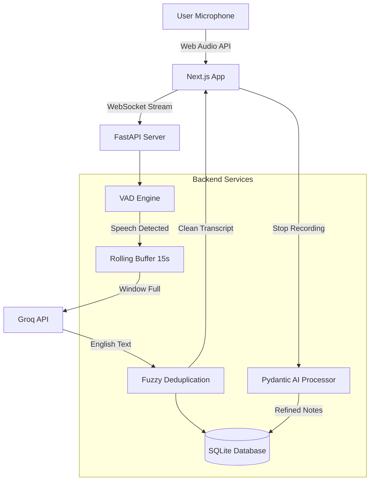

# Architecture Deviation Log - Phase 1

**Date:** January 6, 2026
**Version:** 1.0

This document tracks significant deviations between the original Phase 1 Plan (`PHASE_1_PLAN.md`) and the final deployed architecture.

## 1. Core Architecture Changes

| Component | Planned | Actual | Reason |
|-----------|---------|--------|--------|
| **Client App** | Tauri (Rust + React) | **Pure Web (Next.js)** | **Simplification**: Tauri added unnecessary complexity (Rust backend, permission issues) for a Meeting Co-Pilot. Web Audio API proved proficient for real-time streaming. |
| **Audio Capture** | Tauri Rust Backend (`cpal`) | **Browser Web Audio API** (`AudioWorklet`) | **Performance/Compatibility**: Browser `AudioWorklet` runs in a separate thread, providing stable 16kHz downsampling without blocking the main thread. Removed dependency on Rust. |
| **Backend Integration** | Tauri `invoke` commands | **HTTP REST + WebSocket** | **Standardization**: Moved to standard client-server model. Easier to scale, debug, and deploy remotely if needed. |

## 2. Transcription Engine

| Feature | Planned | Actual | Reason |
|---------|---------|--------|--------|
| **Provider** | Local Whisper / Parakeet | **Groq Whisper API** (Large v3) | **Latency/Accuracy**: Local models struggled with multilingual (Hinglish) accuracy and latency. Groq offers near real-time (~500ms) with `large-v3` accuracy. |
| **Language Support** | Standard Transcription | **Translation Mode** | **User Requirement**: Mixed Hindi/English (Hinglish) content needed to always output English notes. Standard transcription kept Hindi script. |
| **Streaming Logic** | Simple Chunking | **VAD + Rolling Buffer** | **Quality**: Fixed chunks cut words. Implemented `SimpleVAD` (Voice Activity Detection) + `RollingAudioBuffer` (15s window, 12s slide) to capture complete phrases. |
| **VAD Engine** | SimpleVAD / Silero | **TEN VAD** (with fallbacks) | **Performance**: Integrated TEN VAD for higher precision and lower latency frame-level detection. Maintained SileroVAD and SimpleVAD as fallbacks for system compatibility. |

## 3. Storage & AI Processing

| Feature | Planned | Actual | Reason |
|---------|---------|--------|--------|
| **Meeting Storage** | Local JSON Files | **SQLite Database** | **Robustness**: Needed structured query capabilities for reliability and future search features. |
| **LLM Integration** | Simple API Calls | **Pydantic AI Agents** | **Structure**: Required structured outputs for Action Items, Decisions, and Summaries. Pydantic AI ensures consistent JSON schemas. |
| **Processing Trigger** | Manual | **Automatic Post-Recording** | **UX**: Automatically triggers LLM processing immediately after recording stops to generate notes without user action. |

## 4. Removed Components

- **Tauri (`src-tauri/`)**: Completely removed.
- **Parakeet Model**: Removed in favor of Groq.
- **ElevenLabs Scribe**: Experimented with but removed due to less flexible buffering control compared to Groq implementation.

## 5. Current Architecture Diagram (Actual)

## 6. Impact on Future Phases

- **Phase 2 (Polish)**: Simplified testing (only browser compatibility needed).
- **Phase 3 (AI Features)**: Easier integration (standard HTTP endpoints already set up).
- **Deployment**: Can now be deployed as a standard web app (Docker container) rather than a desktop executable.
