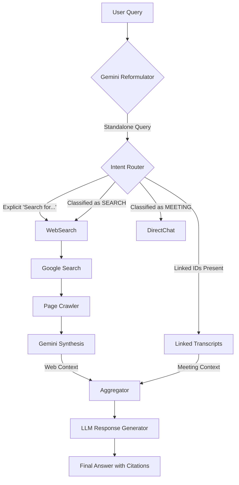

# Context-Aware Meeting Chatbot with Web Search: Design & Implementation

## 1. Overview

The **Context-Aware Meeting Chatbot** is an advanced AI assistant designed to run alongside active meetings. It integrates three critical knowledge sources to provide accurate, grounded answers:

1.  **Live Meeting Context:** Real-time access to the ongoing discussion (Transcript Buffer).
2.  **Historical Context:** Access to linked meetings (Full Transcripts) and Global Search (Vector DB - *currently disabled*).
3.  **External Web Intelligence:** On-demand access to live web data via Google Search (SerpAPI) + Crawling + Gemini Synthesis.

---

## 2. Implementation Architecture (Current State)

The system uses a **Router-based Hybrid Architecture** implemented in `transcript_processor.py`.

### 2.1 The Pipeline

1.  **Input:** User asks a question (e.g., "Search for how to fix it").
2.  **Step 0: Contextual Reformulation (Gemini Flash)**
    *   **Goal:** Resolve pronouns ("it", "that") and remove conversational filler.
    *   **Input:** Chat History + Raw Question.
    *   **Logic:** If user says "previous question", replace with actual topic.
    *   **Output:** Standalone keyword query (e.g., "fix deployment API timeouts").
3.  **Step 1: Intent Routing (Classifier & Keywords)**
    *   **Explicit Trigger:** Checks for "search for", "google", "find on web".
    *   **Implicit Router:** If no explicit trigger, a Gemini Flash classifier analyzes the query vs. available context.
        *   *Result:* "SEARCH" or "MEETING".
4.  **Step 2: Retrieval (Parallel)**
    *   **Web:** If triggered, calls `search_web()` -> SerpAPI -> Trafilatura Crawl -> Gemini Summarization.
    *   **Linked Meetings:** If `allowed_meeting_ids` present, fetches full transcripts from SQL.
    *   **Global Search:** *Disabled (Jan 2026)* to save costs/complexity, but code exists to query Vector DB.
5.  **Step 3: Synthesis (Hybrid Prompt)**
    *   The LLM System Prompt is constructed dynamically:
        ```text
        CURRENT MEETING CONTEXT: ...
        EXTERNAL WEB CONTEXT: ... (Injected here)
        LINKED MEETING CONTEXT: ...
        HISTORY: ...
        ```
    *   **Instructions:** "If EXTERNAL WEB CONTEXT is provided, use it to fact-check... If citing meeting use [Meeting], if web use [Source N]."

### 2.2 Architecture Diagram



---

## 3. Key Components

### 3.1 Contextual Reformulator
*   **Problem:** Users ask "How do I fix **it**?" or "Search for **the previous question**".
*   **Solution:** Before any logic runs, Gemini Flash rewrites the query.
*   **Example:**
    *   *History:* User asked about "Load Testing".
    *   *Input:* "Search web for how to do it properly"
    *   *Rewritten:* "proper load testing guide best practices"

### 3.2 Web Search Tool (`search_web`)
*   **Provider:** SerpAPI (Google Search).
*   **Process:**
    1.  Get top 5 URLs.
    2.  **Crawl** page content (using `trafilatura` for clean text).
    3.  **Synthesize** using Gemini Flash to generate a mini-report with citations `[Source 1]`.
    4.  Return this "Mini-Report" to the main Chat LLM.

### 3.3 Hybrid Context Injection
*   Instead of returning the search result *directly* to the user, we inject it into the **System Prompt**.
*   **Benefit:** The Chat LLM can compare/contrast.
    *   *Prompt:* "Our budget is $5k [Meeting]. Web says avg cost is $7M [Web]."
    *   *Output:* "Your budget of $5k is significantly below the industry average of $7M."

---

## 4. Current Limitations & Configuration

*   **Vector DB:** Currently **DISABLED** in code. Global search returns 0 results.
*   **Latency:** Web search adds ~3-6 seconds to the response time.
*   **UI Feedback:** The system yields a "🔍 Searching web for: *query*..." message to the stream so the user knows it's working.

## 5. Usage Guide

### Implicit Search
Just ask a question that requires external data.
> "What is the current stock price of NVIDIA?"
> *System auto-detects -> Searches Web -> Answers.*

### Explicit Search
Use "Search for" to force a web search.
> "Search for react best practices."

### Meta-References
Refer to previous topics naturally.
> "I meant search for the previous topic."
> *System reformulates -> Searches for the actual topic.*
