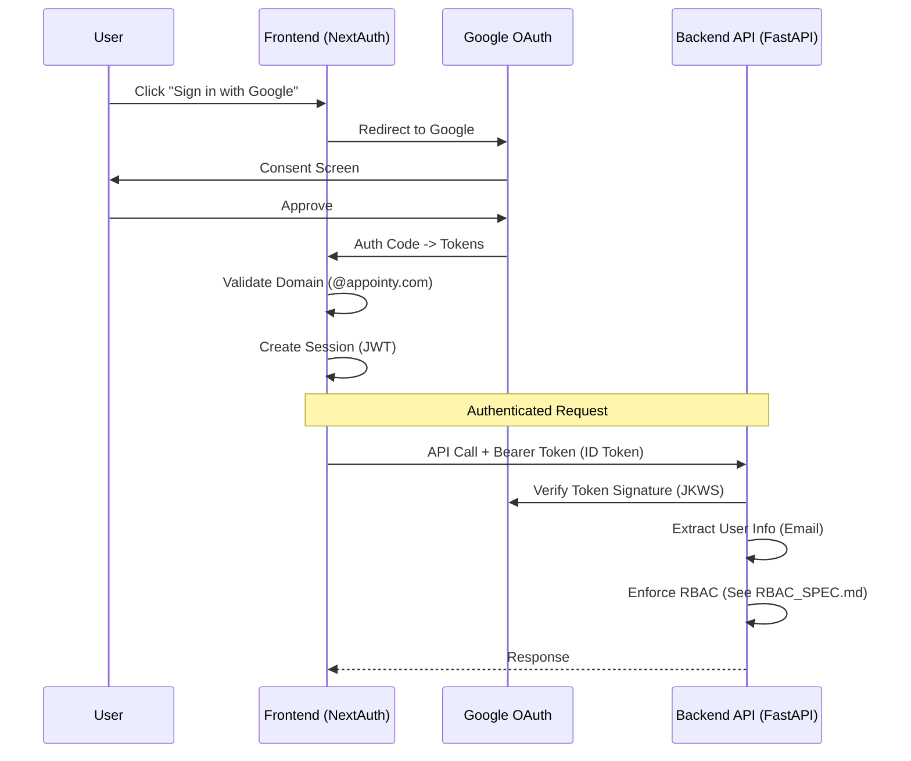

# Authentication Implementation

## Overview
Meeting Co-Pilot uses **Google OAuth** for secure authentication. Access is strictly limited to users with **`@appointy.com`** email addresses.

> [!NOTE]
> For Role-Based Access Control (Permissions, Workspaces, Meeting Roles), please refer to **[RBAC_SPEC.md](./RBAC_SPEC.md)**.

---

## Authentication Architecture



## Technology Stack

| Component | Technology | Purpose |
|-----------|------------|---------|
| **Frontend** | NextAuth.js v4 | Session management, OAuth flow |
| **Provider** | Google OAuth 2.0 | Identity Provider (IdP) |
| **Backend** | FastApi + python-jose | Token verification |
| **Protocol** | OIDC (OpenID Connect) | Standardization |

---

## Setup & Configuration

### 1. Google Cloud Console
1. Create a Project in GCP.
2. Configure OAuth Consent Screen (Internal/Private to Organization if possible).
3. Create OAuth 2.0 Credentials (Web Application).
4. Add Authorized Redirect URIs:
   - `http://localhost:3000/api/auth/callback/google`
   - `https://your-production-domain.com/api/auth/callback/google`

### 2. Environment Variables

#### Frontend (`.env.local`)
```bash
GOOGLE_CLIENT_ID=your-client-id
GOOGLE_CLIENT_SECRET=your-client-secret
NEXTAUTH_URL=http://localhost:3000 # or production URL
NEXTAUTH_SECRET=openssl-generated-secret
```

#### Backend (`.env`)
```bash
GOOGLE_CLIENT_ID=your-client-id # For validation
```

---

## Security Measures

1.  **Domain Restriction**: Hardcoded check in NextAuth callback rejects non-`@appointy.com` emails.
2.  **Stateless Validation**: Backend verifies JWT signature using Google's public keys (JWKS) on every request. No database session lookups required for validity check (though RBAC requires DB).
3.  **Audience Check**: Backend ensures token was issued specifically for this `GOOGLE_CLIENT_ID`.

---

## Testing

### Manual Verification
1. Open Login Page.
2. Sign in with `@appointy.com` account -> **Success**.
3. Sign in with personal Gmail -> **Access Denied**.
4. Check Browser DevTools -> Application -> Cookies -> `next-auth.session-token` exists.

### API Parsing
The backend extracts `user_id` (email) from the token. This `user_id` is then passed to the permissions layer.
